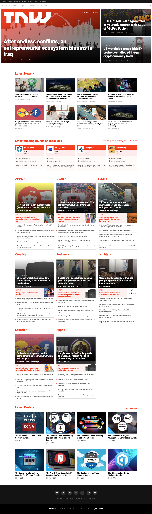

# [The Next Web Clone](https://raw.githack.com/KaushikShivam/the_next_web_clone/development/index.html) - A replica of [NWC](https://thenextweb.com/)



## Table of content
- [Description](#description)
- [Installation](#installation)
- [Contact](#contact)

## Description
[Newsweek Clone](https://raw.githack.com/KaushikShivam/the_next_web_clone/development/index.html) is a clone project that we worked on for Microverse. It uses HTML5 and CSS3.
It uses CSS flexbox, grids and media queries and support all major device widths.
[Reference link](https://thenextweb.com/)


## Installation

1. Clone the project to your local directory
```
git clone https://github.com/KaushikShivam/newsweek_clone
```
2. Open the index.html file in your browser to view the website in all its glory (Live-server is recommended to view live changes automatically)

## Contact
This template was created in collaboration with Rodolfo and Shivam
You can contact me at:
- [Email](shivamkaushikofficial@gmail.com)
- [Linkedin](https://www.linkedin.com/in/shivam-kaushik-bb8162102/)
- [Twitter](https://twitter.com/kShivamDev)
- [Medium](https://medium.com/@shivamkaushikofficial)

You can contact Rodolfo at:
- [Email](acosta.rodolfo.rca@gmail.com)


